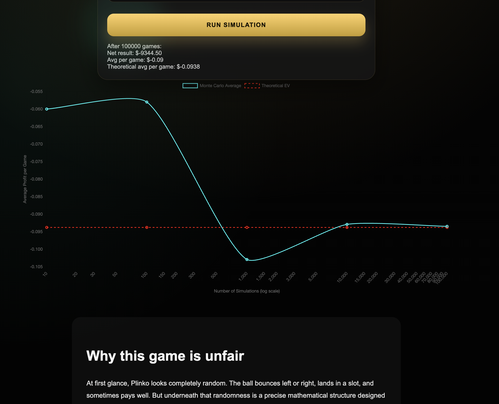

#  Plinko EV Simulator

An interactive Plinko simulator that visualizes how randomness converges to mathematical expectation.

This project demonstrates how **Monte Carlo simulation**, **binomial probability**, and **expected value (EV)** explain why the house always wins in the long run.

---

##  Live Demo

https://musaboyev.github.io/monte-carlo-plinko/

---

##  What this shows

- Each ball drop follows a **binomial process** (left/right decisions)
- Outcomes are not uniformly random — they cluster toward the center
- The game has a **negative expected value**
- Over many trials, results **converge to the theoretical EV**

---

##  Features

-  Interactive Plinko simulator  
-  Monte Carlo convergence graph  
-  Theoretical EV comparison  
-  Log-scale visualization of simulations  
-  Embedded explanations (binomial & expected value)  
-  Educational breakdown of why the game is unfair  

---

##  Core Concepts

### Binomial Distribution
Each peg introduces a binary outcome (left/right). After multiple rows, the final position follows a binomial distribution, making middle outcomes far more likely than extremes.

### Expected Value (EV)
\[
EV = \sum (probability \times payout)
\]

In this game:
- Small payouts occur frequently  
- Large payouts occur rarely  

Result:
> **Negative EV → long-term loss**

---

### Monte Carlo Simulation

We simulate the game thousands (or millions) of times and track:

- Running average profit per game
- Convergence toward theoretical EV

The graph demonstrates the **Law of Large Numbers** in action.

---

## 📉 Example Result

After ~1,000,000 simulations:

- Average profit per game ≈ **-0.093**
- Theoretical EV ≈ **-0.0938**

 The simulation converges to the expected value.

---

##  Tech Stack

- HTML  
- CSS  
- JavaScript  
- Chart.js  

---

##  Key Insight

> The game feels random in the short term, but mathematically guarantees a loss over time.

---

##  Future Improvements

- Adjustable payout tables  
- Different probability biases  
- Animated convergence  
- Confidence intervals  

---

## Preview

---

##  License

MIT License
